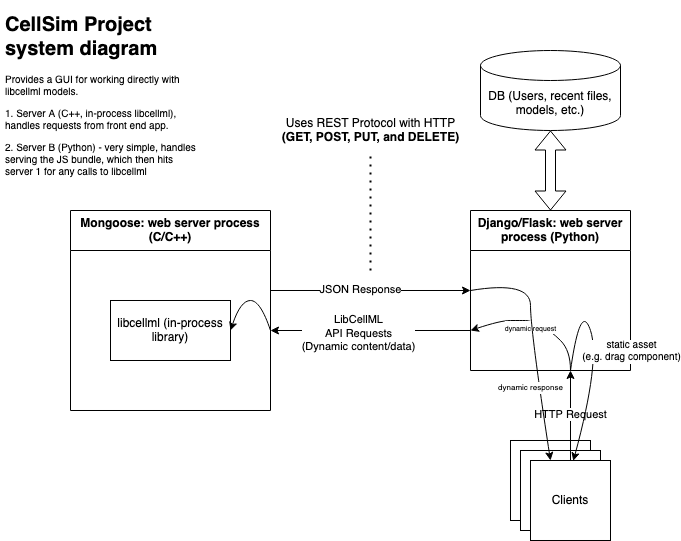

# CellML Project

## Visualise and Flatten Model Functionality

## Create Model Functionality

## System Design

### Overview

Idea is to serve libcellml C++ library ([https://github.com/cellml/libcellml](https://github.com/cellml/libcellml)) with a C++ web server, and write a Javascript web application that has a nice GUI for using the library.

#### Backend

The web server would run libcellml in-process, so we would compile the web server binary together with libcellml all from source.

A database would be added for the web server to persist user information between sessions (login, state of libcellml models, et cetera).

#### Frontend

The frontend would provide a graphical interface for working with libcellml models (ball-and-stick type thing), as well as access to directly upload and edit libcellml XML files (which could then be viewable and editable in the GUI, possibly side by side).

29/5/2024
Updated wireframe of create window

## Project Considerations

### Build Wrangling Milestones

* Create git repo
    * **Work on a branch, master always builds (set branch protecc on)**
    * Check licensing on libcellml, any other dependencies
        * Suggested organization: 
            * README.md
                * Instructions for build
            * cpp/
                * CMakeLists.txt
                * third_party/
                    * libcellml/
                        * include/
                        * src/
                    * webserver/
                        * include/
                        * src/
            * src/
                * CmakeLists.txt
                * CellSimBackend.cpp
            * js/
                * CellSim/
            * scripts/
                * Random junk
* Build and run libcellml C++ library from source
* Build and run some C++ web server from source (research easiest - something that uses CMake?)
* Build and link C++ web server against libcellml
* Build and run simple VueJS ([https://v2.vuejs.org/v2/guide/ssr](https://v2.vuejs.org/v2/guide/ssr)) application
    * Serve it via the web server

### System Design

* REST API (probably map these just to library calls for libcellml)
* Database schema
* File storage (can probably start by just dumping all the files in the DB, but future iteration could use blob storage)
* Front end features

### Production

* Hosting and deployment, cloud services, CI (continuous integration), devops

## Docs

### libcellml

1. git clone [git@github.com](mailto:git@github.com):cellml/libcellml.gi
2. libcellml
3. mkdir build
4. cd build
5. cmake ../
6. make -j

Notes:

* Tests were failing on [https://github.com/cellml/libcellml/commit/0c4c53c3c586b743cba071641da2ada69211b90f](https://github.com/cellml/libcellml/commit/0c4c53c3c586b743cba071641da2ada69211b90f) 
* 
